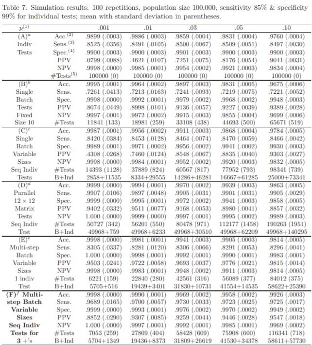

# Multi Stage Batch Testing with Dilution Effect Considerations

## Mult Stage Batch Testing without Dilution Effect Considerations
Regular_Batch_Testing.py is the main source code with all the functions and logic to produce results of the multi-stage batch testing simulation.
Final BTK.ipynb will create a dataframe to display all the statistics

My results replicate Stony Brook University's 2020 Paper. https://arxiv.org/pdf/2006.16079.pdf

## Mult Stage Batch Testing with Dilution Effect Considerations
Dilution Effect Considerations are introduced with this paper (pages 6-8)
https://arxiv.org/abs/2008.06642

### gamma_eta_n_d.py
Generates dilution effect by creating a function, Gamma, that takes in the batch size, the number of positves in the batch
and returns the false negative rate.
These results are saved in F_N_d.npy

### Dilultion_Effect.py
Uses the false negative rates generated by gamma_eta_n_d.py to improve our multi-stage batch testing simulation results.